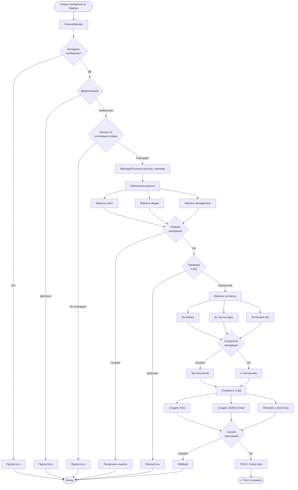
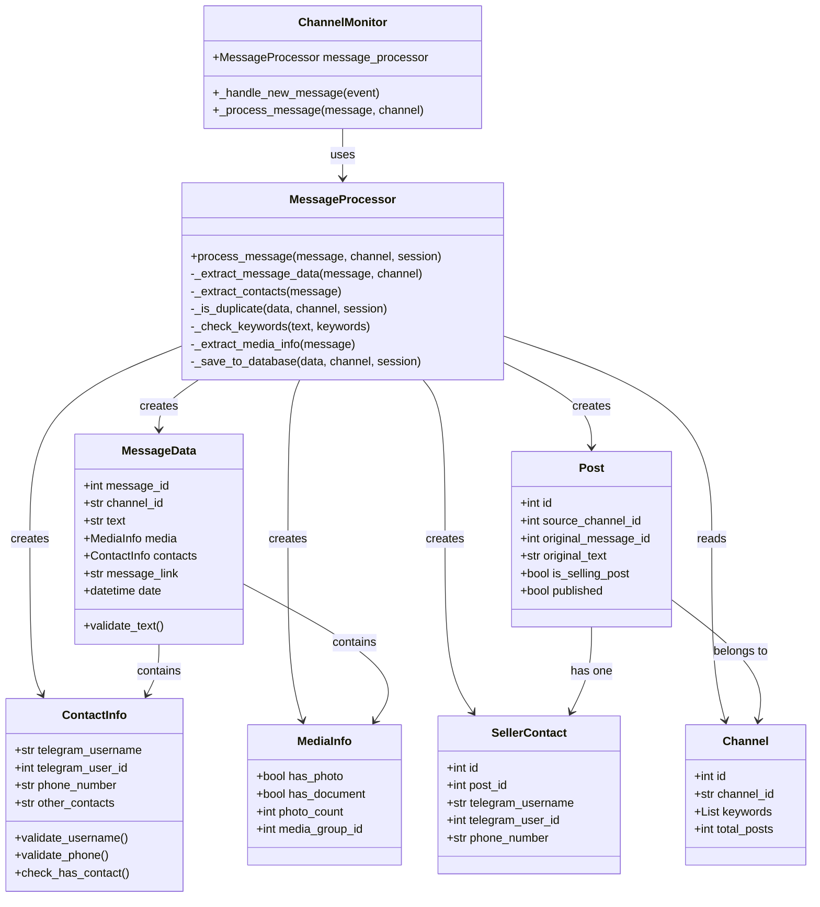
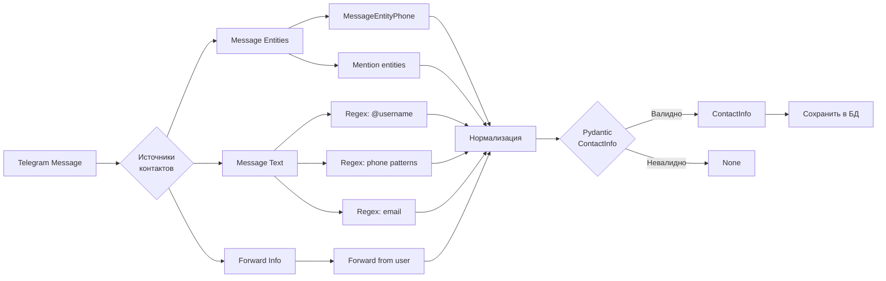
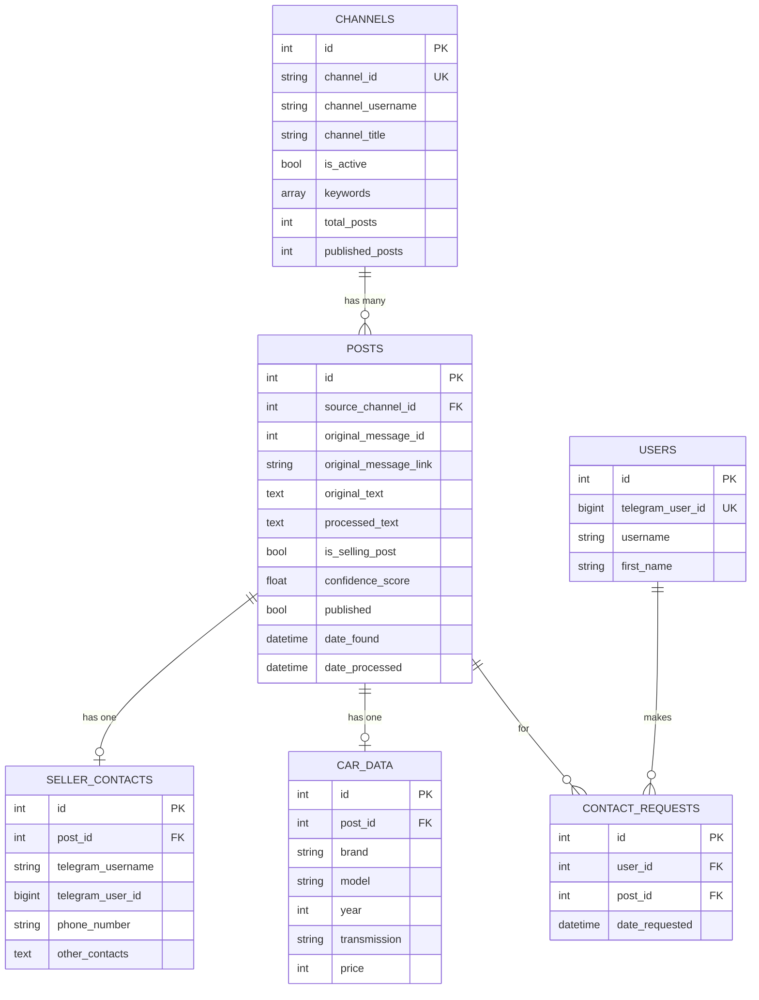
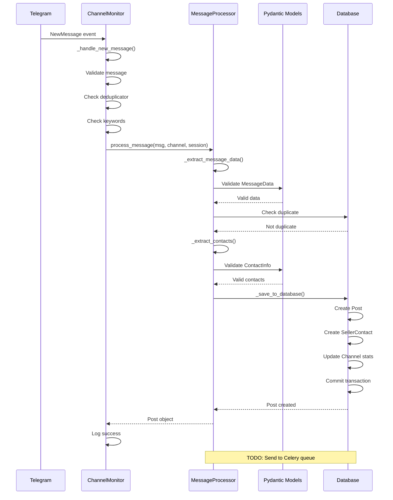
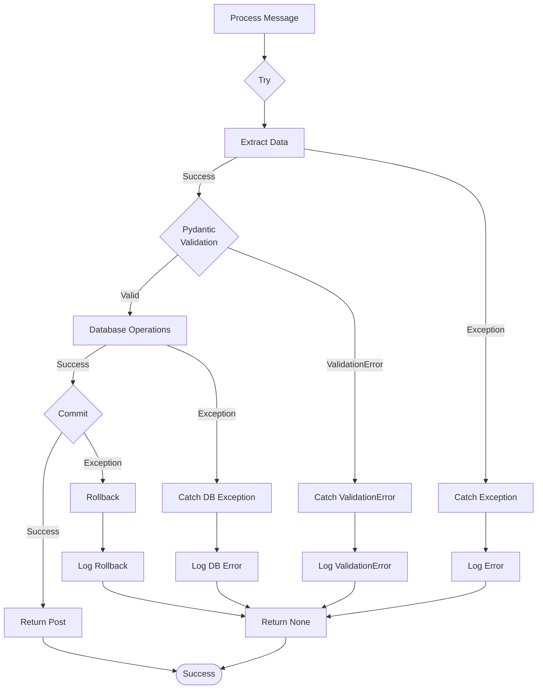
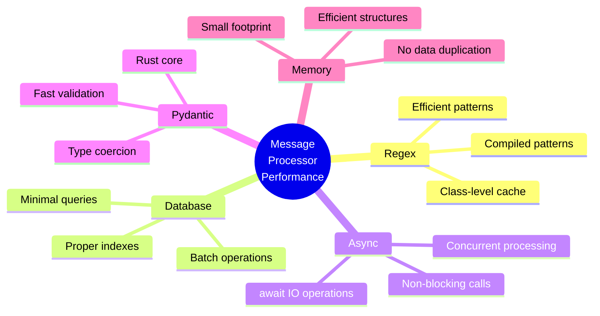
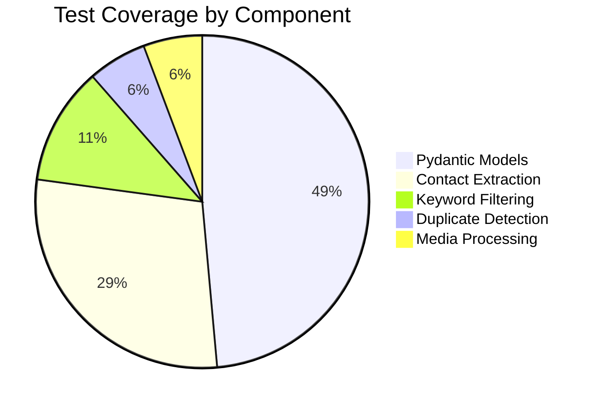

# Архитектура MessageProcessor

## Диаграмма потока обработки сообщений



## Архитектура компонентов



## Извлечение контактов



## Валидация данных с Pydantic

```mermaid
flowchart TD
    Input[Raw Data] --> Field1[Field Validators]
    
    Field1 --> Username[@field_validator username]
    Field1 --> Phone[@field_validator phone]
    
    Username --> CleanUsername[Удалить @]
    Phone --> NormalizePhone[Добавить +, форматировать]
    
    CleanUsername --> Model[@model_validator]
    NormalizePhone --> Model
    
    Model --> CheckContact[check_has_contact]
    
    CheckContact -->|Нет контактов| ValidationError[ValidationError]
    CheckContact -->|OK| Validated[✅ Validated Data]
    
    Validated --> Serialize{Serialization}
    
    Serialize --> Dict[model_dump]
    Serialize --> JSON[model_dump_json]
```

## База данных: связи между таблицами



## Интеграция с ChannelMonitor



## Обработка ошибок



## Производительность: оптимизации



## Тестовое покрытие



---

**Легенда:**
- 🟢 **Зеленый** - Успешное выполнение
- 🔴 **Красный** - Ошибка/исключение
- 🟡 **Желтый** - Условие/проверка
- 🔵 **Синий** - Процесс/операция


